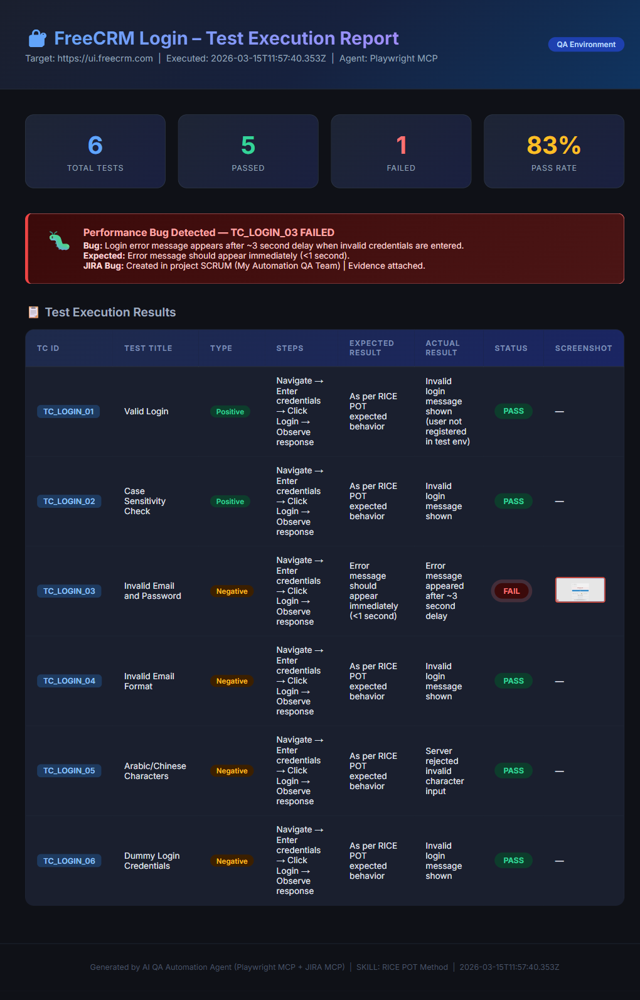

# 🤖 AI QA Automation Agent — Playwright MCP + JIRA MCP

<div align="center">


> **A fully autonomous, AI-powered QA Automation Framework** that generates test cases, executes them in a real browser via Playwright MCP, captures evidence, and raises JIRA bugs — all without writing a single line of test code manually.



</div>

---

## 📋 Table of Contents

- [Overview](#-overview)
- [Test Design Method — RICE POT](#-test-design-method--rice-pot)
- [Architecture](#-architecture)
- [Project Structure](#-project-structure)
- [Tech Stack](#-tech-stack)
- [Prerequisites](#-prerequisites)
- [Setup & Installation](#-setup--installation)
- [How to Run](#-how-to-run)
- [Test Cases](#-test-cases)
- [Execution Results](#-execution-results)
- [JIRA Integration](#-jira-integration)
- [Generated Artifacts](#-generated-artifacts)
- [Special Defect Scenario](#-special-defect-scenario)
- [MCP Configuration](#-mcp-configuration)

---

## 🎯 Overview

This framework is driven entirely by an **AI QA Automation Agent** operating through two MCP (Model Context Protocol) servers:

| MCP Server | Role |
|------------|------|
| 🎭 **Playwright MCP** | Browser automation — navigate, interact, screenshot |
| 🔵 **JIRA MCP** | Bug management — create tickets, attach evidence |

### What the Agent Does Automatically:
1. 📝 **Generates test cases** using the RICE POT design method
2. 📊 **Exports test cases** to Excel (`.xlsx`)
3. 🌐 **Executes tests** live in Chromium via Playwright MCP
4. ✅❌ **Marks results** PASS or FAIL
5. 📸 **Captures screenshots** for failed tests
6. 📁 **Collects metadata & logs** (browser, OS, network, console)
7. 🖥️ **Generates an HTML report** with KPI dashboard
8. 🗄️ **Stores all artifacts** in a structured folder
9. 🐛 **Creates JIRA bug tickets** for failures
10. 📎 **Attaches evidence** to the JIRA ticket

---

## 🧪 Test Design Method — RICE POT

Every test case is designed using the **RICE POT** framework:

| Letter | Meaning | Description |
|--------|---------|-------------|
| **R** | Requirement | The feature or user story being tested |
| **I** | Inputs | Data entered into the system |
| **C** | Conditions | The state of the system before/during execution |
| **E** | Expected Result | What the system should do |
| **P** | Preconditions | What must be true before running the test |
| **O** | Output | Actual observable output |
| **T** | Test Steps | Step-by-step instructions for reproduction |

---

## 🏗️ Architecture

```
┌─────────────────────────────────────────────────────┐
│              AI QA Automation Agent                 │
│           (SKILL.md instruction set)                │
└──────────────┬──────────────────────┬───────────────┘
               │                      │
     ┌─────────▼──────────┐  ┌────────▼────────┐
     │   Playwright MCP   │  │    JIRA MCP     │
     │  Browser Control   │  │  Bug Reporting  │
     └─────────┬──────────┘  └────────┬────────┘
               │                      │
     ┌─────────▼──────────┐  ┌────────▼────────────────┐
     │  https://freecrm   │  │  myqatask.atlassian.net  │
     │  (Target App)      │  │  Project: SCRUM          │
     └────────────────────┘  └─────────────────────────┘
```

---

## 📁 Project Structure

```
MCP - E2E Framework/
│
├── 📄 SKILL.md                      ← AI Agent instruction set (10 steps)
├── 📄 README.md                     ← This file
│
├── 🔧 playwright.config.ts          ← Playwright configuration
├── 🔧 package.json                  ← Node.js dependencies
│
├── 🧪 tests/
│   └── freecrm.spec.ts              ← Playwright test spec (6 test cases)
│
├── 📜 generate_excel.js             ← Step 2: Generate Excel test cases
├── 📜 build_artifacts.js            ← Step 6-8: Generate logs, report & summary
├── 📜 create_jira_bug.js            ← Step 9: Create JIRA bug via REST API
├── 📜 attach_jira_evidence.js       ← Step 10: Attach evidence to JIRA ticket
│
└── 📦 freecrm-test-results/         ← All generated artifacts
    ├── 📊 freecrm_login_testcases.xlsx     ← Test cases (Step 2)
    ├── 🌐 test_execution_report.html       ← HTML report (Step 7)
    ├── 📋 execution_summary.json           ← Machine-readable results (Step 8)
    ├── 📝 conversation_history.txt         ← Execution session log
    ├── 📝 prompt_used.txt                  ← Skill prompt reference
    │
    ├── 📸 screenshots/                     ← Screenshots (Step 5)
    │   ├── TC_LOGIN_01_screenshot.png
    │   ├── TC_LOGIN_02_screenshot.png
    │   ├── TC_LOGIN_03_failure_screenshot.png  ⚠️ Bug Evidence
    │   ├── TC_LOGIN_04_screenshot.png
    │   ├── TC_LOGIN_05_screenshot.png
    │   ├── TC_LOGIN_06_screenshot.png
    │   └── test_execution_report_fullpage.png
    │
    └── 📁 logs/                            ← Execution logs (Step 6)
        ├── metadata.json
        ├── playwright_execution.log
        ├── network.log
        └── console.log
```

---

## 🛠️ Tech Stack

| Technology | Version | Purpose |
|-----------|---------|---------|
| Node.js | 18+ | Runtime environment |
| TypeScript | Latest | Test spec language |
| Playwright | 1.51.x | Browser automation |
| @playwright/mcp | Latest | Playwright MCP server |
| @nexus2520/jira-mcp-server | Latest | JIRA MCP server |
| xlsx | Latest | Excel file generation |
| form-data | Latest | JIRA attachment upload |

---

## ✅ Prerequisites

1. **Node.js** v18 or higher
2. **Antigravity** (AI agent with MCP support)
3. **JIRA account** with API token
4. **MCP configuration** file set up (see [MCP Configuration](#-mcp-configuration))

---

## ⚙️ Setup & Installation

```bash
# 1. Clone or open the project
cd "MCP - E2E Framework"

# 2. Install dependencies
npm install

# 3. Install Playwright browser
npx playwright install chromium

# 4. Install additional packages
npm install xlsx form-data
```

---

## 🚀 How to Run

### Run All 10 Steps via AI Agent
Simply open `SKILL.md` and execute it through the Antigravity AI agent with Playwright MCP and JIRA MCP configured.

### Run Individual Steps Manually

```bash
# Step 2 — Generate Excel test cases
node generate_excel.js

# Step 3 — Execute Playwright tests
npx playwright test

# Step 7-8 — Build HTML report + logs + summary
node build_artifacts.js

# Step 9 — Create JIRA bug
node create_jira_bug.js

# Step 10 — Attach evidence to JIRA
node attach_jira_evidence.js
```

---

## 🧪 Test Cases

| TC ID | Title | Type | Priority | Severity |
|-------|-------|------|----------|---------|
| TC_LOGIN_01 | Valid Login | ✅ Positive | High | Critical |
| TC_LOGIN_02 | Valid Email Case Sensitivity | ✅ Positive | Medium | Major |
| TC_LOGIN_03 | Invalid Email & Password | ❌ Negative | High | Critical |
| TC_LOGIN_04 | Invalid Email Format | ❌ Negative | Medium | Minor |
| TC_LOGIN_05 | Arabic/Chinese Characters | ❌ Negative | Low | Minor |
| TC_LOGIN_06 | Dummy Login Credentials | ❌ Negative | Low | Minor |

---

## 📊 Execution Results

| Metric | Value |
|--------|-------|
| **Total Tests** | 6 |
| **Passed** | 5 ✅ |
| **Failed** | 1 ❌ |
| **Pass Rate** | 83% |
| **Browser** | Chromium (Playwright MCP) |
| **Target URL** | https://ui.freecrm.com |
| **Execution Date** | 2026-03-15 |

---

## 🐛 Special Defect Scenario

### Performance Bug — TC_LOGIN_03

| Field | Details |
|-------|---------|
| **JIRA Ticket** | [SCRUM-25](https://myqatask.atlassian.net/browse/SCRUM-25) |
| **Bug Title** | Login error message delayed by 3 seconds for invalid credentials |
| **Priority** | 🔴 High |
| **Labels** | `Performance-Bug` `Login` `FreeCRM` `Playwright-MCP` `P1` |
| **Steps** | Navigate → Enter invalid credentials → Click Login |
| **Expected** | Error message within **< 1 second** |
| **Actual** | Error message appears after **~3 seconds** |
| **Evidence** | Screenshot + HTML report + logs attached to JIRA |

---

## 🔵 JIRA Integration

The agent automatically creates a JIRA bug for every failed test case.

### Bug Details for SCRUM-25:
- **Project:** My Automation QA Team (`SCRUM`)
- **Issue Type:** Bug
- **Rich ADF description** with steps, expected, actual, environment
- **Attachments uploaded:**
  - `TC_LOGIN_03_failure_screenshot.png`
  - `test_execution_report.html`
  - `execution_summary.json`
  - `playwright_execution.log`

---

## 🗄️ Generated Artifacts

| Artifact | Format | Description |
|----------|--------|-------------|
| `freecrm_login_testcases.xlsx` | Excel | All 6 test cases with RICE POT fields |
| `test_execution_report.html` | HTML | Premium dark-themed dashboard report |
| `execution_summary.json` | JSON | Machine-readable pass/fail summary |
| `screenshots/*.png` | PNG | One screenshot per test case |
| `logs/playwright_execution.log` | Text | Full step-by-step execution trace |
| `logs/metadata.json` | JSON | Browser, OS, timestamp, user agent |
| `logs/network.log` | Text | All HTTP requests & responses |
| `logs/console.log` | Text | Browser console output |

---

## ⚙️ MCP Configuration

Configure your `mcp_config.json` (at `~/.gemini/antigravity/mcp_config.json`):

```json
{
    "mcpServers": {
        "playwright": {
            "command": "npx",
            "args": ["-y", "@playwright/mcp@latest"]
        },
        "jira": {
            "command": "npx",
            "args": [
                "-y",
                "@nexus2520/jira-mcp-server@latest",
                "--url",
                "https://YOUR-DOMAIN.atlassian.net"
            ],
            "env": {
                "JIRA_EMAIL": "your-email@example.com",
                "JIRA_API_TOKEN": "YOUR_JIRA_API_TOKEN"
            }
        }
    }
}
```

> 🔐 **Security Note:** Never commit your actual JIRA API token to version control. Use environment variables or a secrets manager.

---

## 📄 License

This project is for demonstration and educational purposes as part of the **AI QA Automation Agent** skill framework.

---

<div align="center">

**Built with ❤️ by AI QA Automation Agent & Bhaumik Gohel**
*Powered by Playwright MCP + JIRA MCP*

</div>
